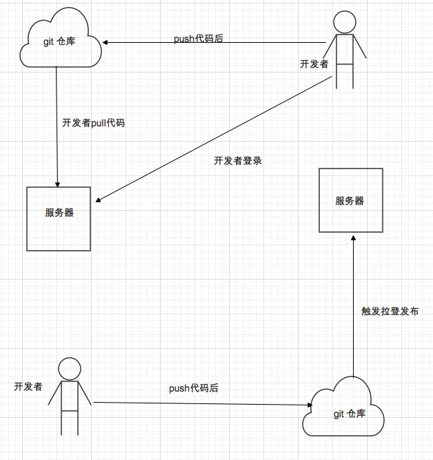

# 拉登应用发布系统
## 一、背景
  由于在内网使用，一般不会存在什么并发，性能瓶颈；上线部署的操作流程其实也是非常简单，在需要更新上线的时候，提交最新代码到 `master`主分支上，然后ssh登录服务器，去执行一个相对应`shell`脚本，拉取最新的，restart一下即可，其实并不复杂，往往会存在一些问题：
- 非常麻烦的人肉部署。
- 一些没有ssh权限的同学更新代码后，都会找别的同学去帮忙重启一下
- 周末节假日，加班同学通知服务器挂掉了；
- 每一次push都要去`restart`一下，其实也是挺烦躁的；
- 一次 `git push` 的代码，如果需要部署在很多台服务器上（3段、5段、8段等测试服务），烦躁
- 随意部署部署，代码质量、规范难以检测；
- 。。。


## 二、webhook
webhook，也就是平时常说的钩子，是一个很有用的工具。可以通过定制`webhook`来监测你在gitlab上的各种事件，最常见的莫过于`push`，`tag push`事件。
如果你设置一个监测`push`事件的`webhook`，那么每当你的项目有任何的提交，这个 `webhook`都会被触发，这时`Gitlab`就会发送一个 `HTTP Post`请求你配置好的地址。
如此一来，就可以通过这种方式完成很多重复性的工作；比如，你可以用 Webhook 来自动触发一些持续集成（CI）工具的运作，比如 拉登应用发布系统；又或者是通过 Webhook 去部署你的线上服务器。

Github 开发者平台的文档中对 Webhook 的所能做的事是这样描述的：
> You’re only limited by your imagination.

**webhook简单分析** 

1. 配置webhook；
2. 一个外网可以访问的主机；
3. 一个能够响应webhook的发布系统；


**简单实现**

  为了响应`webhook`所发出的请求，从而做一些我们想做的事情，我们得先实现一个响应服务器。初步实现 采用 Node 来
实现一个原型；
```javascript
var http = require('http')
  , exec = require('exec');

const PORT = 9988
  , PATH = '../html';

var deployServer = http.createServer(function(request, response) {
  if (request.url.search(/deploy\/?$/i) > 0) {

    var commands = [
      'cd ' + PATH,
      'git pull'
    ].join(' && ');

    exec(commands, function(err, out, code) {
      if (err instanceof Error) {
        response.writeHead(500);
        response.end('Server Internal Error.');
        throw err
      }
      process.stderr.write(err);
      process.stdout.write(out);
      response.writeHead(200);
      response.end('Deploy Done.')
    })

  } else {

    response.writeHead(404);
    response.end('Not Found.')

  }
});

deployServer.listen(PORT)
```   
如果还需要实现更多，更复杂的功能，直接在 commands 数组中添加便是。此处我的博客根目录 html 与部署服务器根目录同属一个目录，所以配置常量 PATH = '../html'。只要启动了服务器，那么 Webhook 就可以通过类似于 http://192.168.xxx.xxx:9988/deploy/ 的路径来部署我的应用。
```
# 在后台启动部署服务器
$ node server.js &
```
我以为服务器部署到这就完了，其实并没有，我遇到一些麻烦。

**Run Node Server Forever**

我在实际使用的时候发现，我的 Node 服务器时不时会自动停掉，具体原因我暂时还没有弄清楚。不过似乎很多人都遇到了这样的困扰，要解决这个问题，forever 是个不错的选择。借助 forever 这个库，它可以保证 Node 持续运行下去，一旦服务器挂了，它都会重启服务器。

安装 forever：
```
$[sudo] npm install -g forever
```
运行：
```
$ cd {部署服务器的根目录}
$ forever start server.js
```
**配置webhook**


